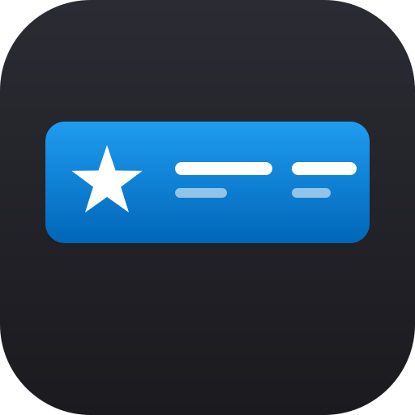
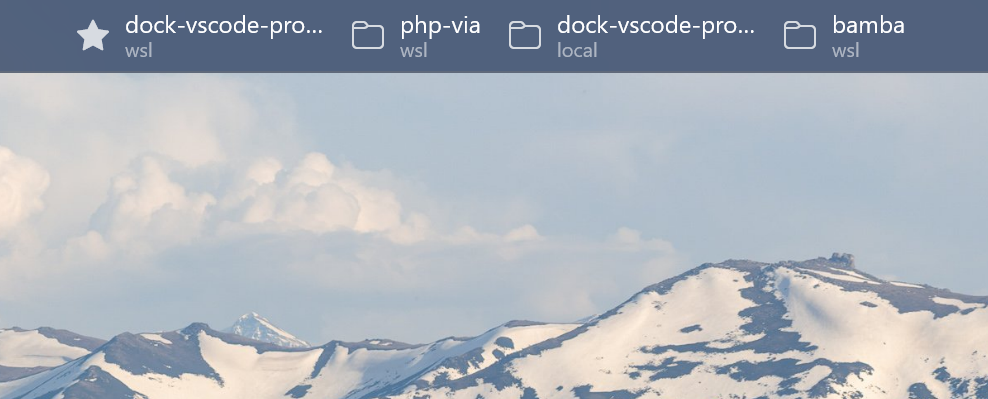

<div align="center">



# VS Code Projects Dock

Your open and pinned VS Code projects as a side-by-side strip in the
PowerToys Command Palette Dock.

[](https://marketplace.visualstudio.com/items?itemName=zweiundeins.vscode-projects-dock-companion)
[](LICENSE)


</div>

---

<div align="center">
  
</div>

## Install

> Requires Windows 11 with **PowerToys** (Command Palette ≥ 0.100) and **Developer
> Mode** on, plus **VS Code** ≥ 1.85 (local and/or WSL remote). Building the dock
> yourself also needs the **.NET 10 SDK** and Visual Studio's WinUI / Windows App SDK
> tooling.

1. **Companion:** install **[VS Code Projects Dock (Companion)](https://marketplace.visualstudio.com/items?itemName=zweiundeins.vscode-projects-dock-companion)**
   from the Marketplace. Search "VS Code Projects Dock" in the Extensions view, or run
   `code --install-extension zweiundeins.vscode-projects-dock-companion`. It's a `ui`
   extension, so installing from a WSL window routes it to the local host automatically.
2. **Dock:** build and register per [`dock/README.md`](dock/README.md), then run
   `Reload` in Command Palette.

## What it does

Pins a live strip of project buttons to the Command Palette Dock. Each button is one
of three states:

| State | Looks | Click |
| --- | --- | --- |
| **Open** (live window) | active | focuses the existing window |
| **Pinned + open** | active, merged once | focuses the existing window |
| **Pinned + closed** | inactive | launches a new VS Code window |

Pinned projects sit on the left, live-only on the right. Works for **local and WSL
remote** windows alike — the exact remote folder URI is what makes matching reliable.

## How it works

Two artifacts with a strict **one-way contract**: VS Code windows publish their state;
the dock consumes it and owns all behaviour.

```
 VS Code window ──┐  writes {windowId}.json          ┌── reads + reaps stale
 VS Code window ──┼─►  %LOCALAPPDATA%\VsCodeProjects ─┤    renders the band
 VS Code window ──┘     Dock\windows\                 └── focus / launch
      (companion)        (shared state dir)                  (dock)
```

- **`companion/`** — a VS Code extension (TypeScript) on the **UI host**, so one
  runtime on Windows sees every window (local and WSL) and writes natively to
  `%LOCALAPPDATA%`. It reports what *is*, never what to do.
- **`dock/`** — a PowerToys Command Palette extension (C# / WinUI 3 / .NET 10, packaged
  MSIX) that reads the directory, merges pinned projects, and performs focus/launch.
- **Liveness** is heartbeat-based: each window bumps its file's mtime on a timer; the
  dock reaps files whose mtime is older than its staleness threshold. Crashes
  (`SIGKILL`, force-quit, power loss) run no exit code, so a heartbeat is the only
  reliable signal — see [`contract/README.md`](contract/README.md).

The state-file shape is pinned by [`contract/state-file.schema.json`](contract/state-file.schema.json),
the single source of truth both sides code against.

## Repository layout

```
.
├── brand/        # canonical icon.svg + render.sh (shared mark; render with rsvg-convert)
├── companion/    # VS Code extension (TypeScript) — the reporter
├── contract/     # state-file JSON schema + prose (single source of truth)
└── dock/         # PowerToys Command Palette extension (C#/.NET 10) — the UI
```

The repo is canonical on WSL ext4. The companion builds in WSL; the dock builds on
Windows over `\\wsl.localhost\...` with the standalone `dotnet` CLI (only the MSIX
*install location* must be local NTFS, since WSL's 9P filesystem can't host a
registered package). See [`dock/README.md`](dock/README.md).

## Configuration

Companion settings (Settings → "VS Code Projects Dock"), both applied live:

| Setting | Default | Meaning |
| --- | --- | --- |
| `vscodeProjectsDock.heartbeatIntervalMs` | `2000` | How often the file's mtime is touched (min 500). |
| `vscodeProjectsDock.sharedDirectory` | `%LOCALAPPDATA%\VsCodeProjectsDock\windows` | Shared state dir; the dock must read the same path. |

The **reap/staleness threshold** is a dock setting (the consumer decides what "dead"
means); keep it a small multiple of the heartbeat.

## Development

```bash
git clone https://github.com/mbolli/dock-vscode-projects
cd dock-vscode-projects

# companion (WSL)
cd companion && npm install && npm run compile   # F5 to debug, npm run package for a VSIX

# icons (regenerate companion + dock assets from brand/icon.svg)
./brand/render.sh                                 # needs rsvg-convert + ImageMagick

# dock (Windows) — see dock/README.md for the dotnet build + Add-AppxPackage loop
```

## Releases

Tag-prefixed so the two channels don't collide: `companion-vX.Y.Z` (VS Code
Marketplace) and `dock-vX.Y.Z` (PowerToys / winget).

## License

[MIT](LICENSE) © zwei und eins gmbh
